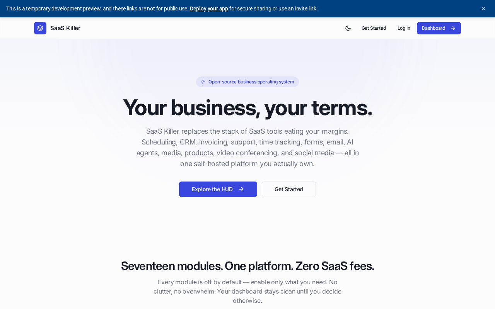
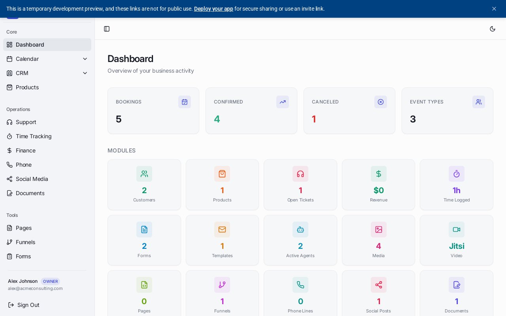
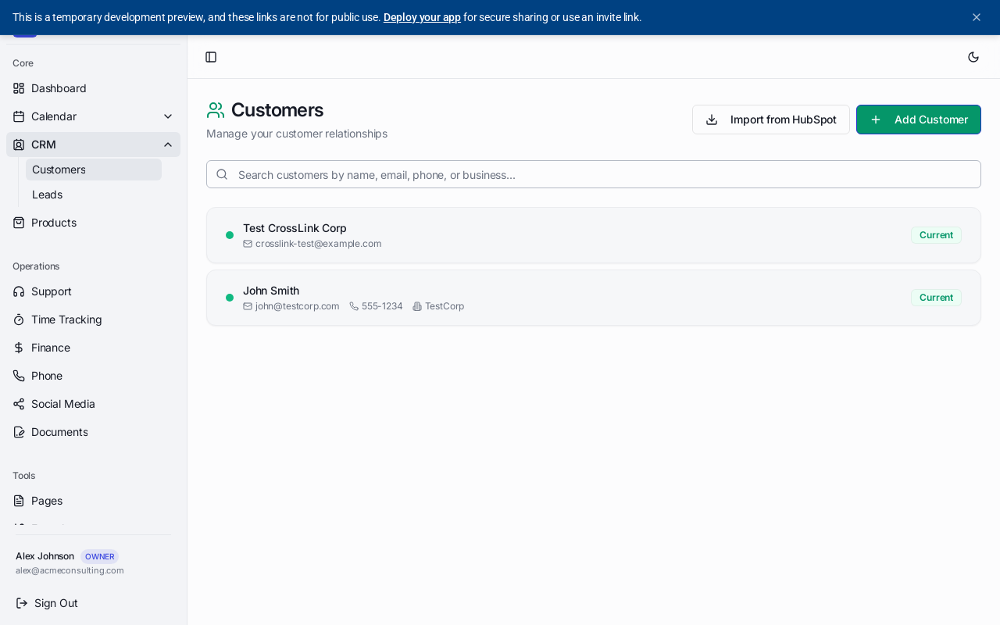
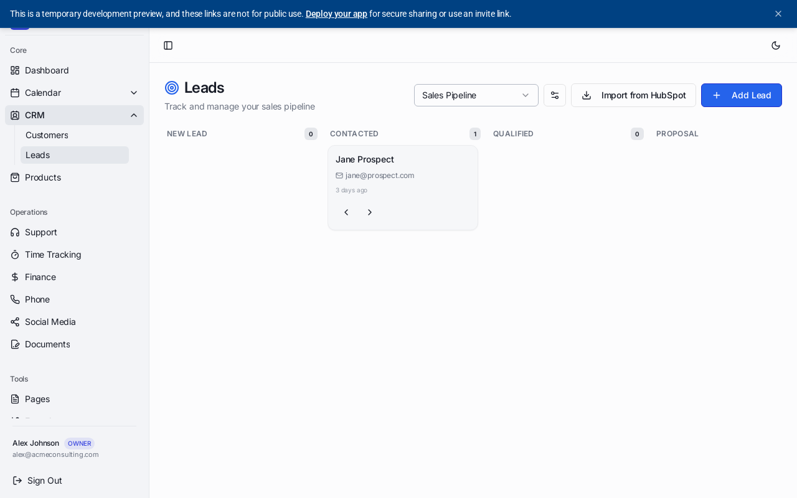
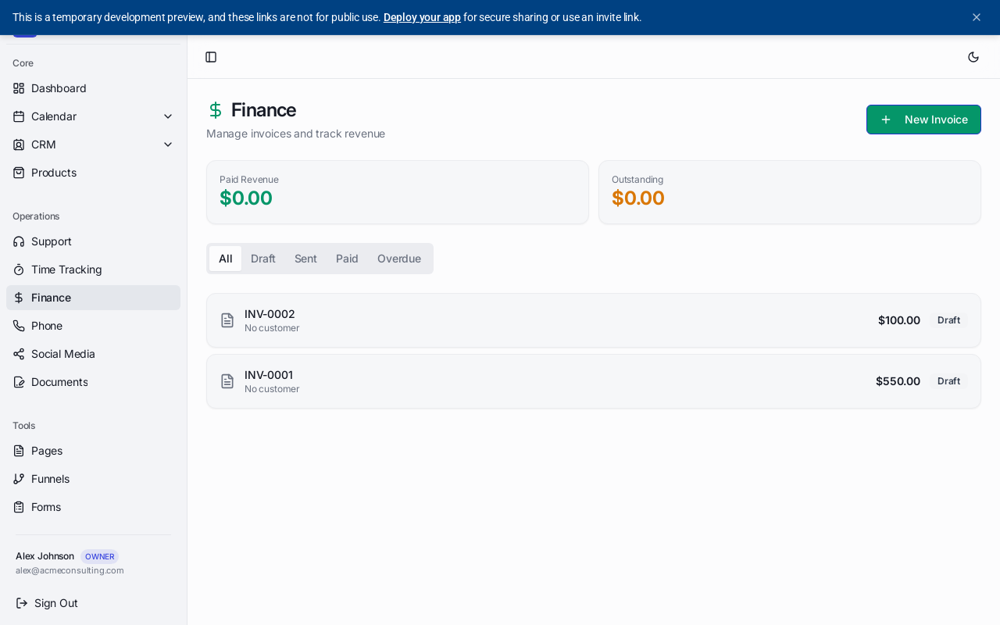
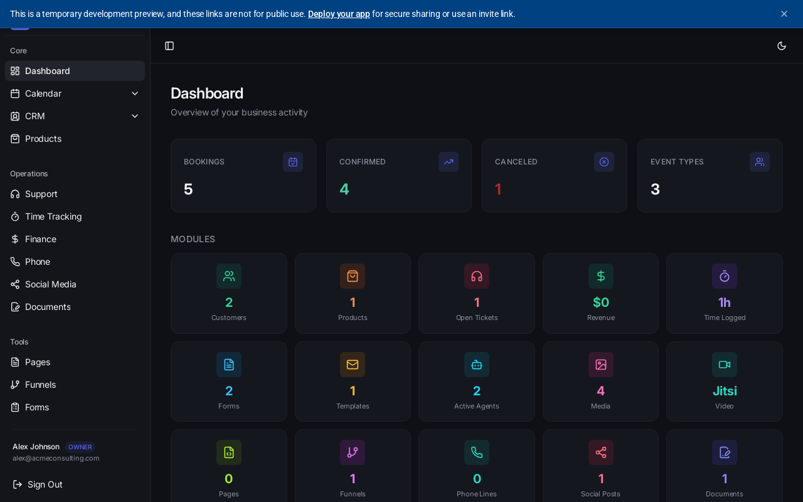

# SaaS Killer

### Your business, your terms.

**Open Source Self-Hosted Business Operating System**

[](https://github.com/bouncerguy/SaaSKiller/actions/workflows/ci.yml)
[](LICENSE)
[](https://replit.com/refer/kenpcox)
[](https://www.digitalocean.com/?refcode=de537efcf1f1&utm_campaign=Referral_Invite&utm_medium=Referral_Program&utm_source=badge)

A modular, self-hosted business platform built for small teams and solo operators. Start with scheduling, grow into CRM, support tickets, finance, and more — all from one unified dashboard. Own your data. Run it anywhere. Kill the SaaS.

**GitHub:** [github.com/bouncerguy/SaaSKiller](https://github.com/bouncerguy/SaaSKiller) · **Built by:** [kencox.com](https://kencox.com) · **Get help:** [vrroom.io](https://vrroom.io)

---

## Screenshots

<table>
  <tr>
    <td><br/><em>Landing Page</em></td>
    <td><br/><em>Dashboard</em></td>
  </tr>
  <tr>
    <td><br/><em>CRM — Customers</em></td>
    <td><br/><em>CRM — Leads Kanban</em></td>
  </tr>
  <tr>
    <td><br/><em>Finance & Invoicing</em></td>
    <td><br/><em>Dark Mode</em></td>
  </tr>
</table>

> Screenshots are captured from the dev seed data. Run the app locally and visit each module to see the full experience.

---

## Quick Start

### Local Development (copy-paste ready)

```bash
git clone https://github.com/bouncerguy/SaaSKiller.git
cd SaaSKiller
cp .env.example .env        # Edit .env with your DATABASE_URL and SESSION_SECRET
npm install
npm run db:push              # Create database tables
npm run dev                  # Start dev server → http://localhost:5000
```

> **macOS users:** Port 5000 conflicts with AirPlay Receiver. Either disable AirPlay in System Settings → General → AirDrop & Handoff, or set `PORT=3001` in your `.env` file.

**Default dev login:** `alex@acmeconsulting.com` / `password123`

In production, seed data is skipped — use the setup wizard at `/setup` instead.

### Replit (Zero Config)

1. [Sign up on Replit](https://replit.com/refer/kenpcox) and import this GitHub repo
2. Click **Run** — PostgreSQL is provisioned automatically
3. Visit `/setup` to create your organization and admin account

### DigitalOcean + Claude (Self-Hosted)

1. [Create a DigitalOcean droplet](https://www.digitalocean.com/?refcode=de537efcf1f1&utm_campaign=Referral_Invite&utm_medium=Referral_Program&utm_source=badge) — 2 vCPUs, 4 GB RAM, Ubuntu 24.04
2. Open [Claude](https://claude.ai) and paste the prompt below — Claude walks you through the full setup

```
I just created a DigitalOcean droplet running Ubuntu 24.04. Help me deploy
SaaS Killer from GitHub (https://github.com/bouncerguy/SaaSKiller).

I need you to walk me through:
1. SSH into the droplet
2. Install Node.js 20+ and PostgreSQL 15+
3. Clone the repo, run npm install
4. Set up DATABASE_URL and SESSION_SECRET environment variables
5. Run npm run db:push to create the database schema
6. Run npm run build && npm start for production
7. Set up Nginx as a reverse proxy on port 80/443
8. Configure SSL with Let's Encrypt using certbot
9. Set up a systemd service so the app runs on reboot

The app runs on port 5000 by default (configurable via PORT env var).
```

### After Setup (All Paths)

- Enable modules in **Settings** — turn on the tools you need
- Create your first **Event Type** for scheduling
- Share your **public booking link** with clients
- Connect **Twilio** for the Phone module (add credentials in Settings)
- Video conferencing works out of the box with **Jitsi** (or configure Zoom links per event)
- Import contacts from **HubSpot** if you have an existing CRM

---

## Why SaaS Killer?

Most business tools are fragmented SaaS products that hold your data hostage, charge monthly fees per module, and disappear if the company shuts down. SaaS Killer takes a different approach:

- **Self-hosted** — Run it on your own server or on Replit. Your data stays yours.
- **Modular** — Start with calendar scheduling, enable more modules as you need them.
- **No vendor lock-in** — Uses standard protocols (ICS calendar feeds) and open formats.
- **Multi-tenant** — One instance can serve multiple organizations.
- **Permission system** — Groups, per-user feature overrides, and role-based access control.

---

## Modules (15)

| Module | Description |
|--------|-------------|
| **Calendar & Booking** | Public booking pages, availability rules, ICS integration, timezone-aware scheduling, embed SDK |
| **CRM — Customers** | Customer management with payment status tracking, cross-module linking (tickets, invoices, time entries) |
| **CRM — Leads** | Lead pipeline with kanban boards, notes, lead-to-customer conversion |
| **Products** | Product & service catalog with pricing, billing cycles, categories, bulk actions |
| **Support** | Ticket management with priority levels, status workflow, customer & team assignment |
| **Finance** | Invoice management with line items editor, auto-numbering, PDF export, email sending, revenue reporting |
| **Time Tracking** | Live start/stop timer, auto-created entries, weekly stats, hours-by-customer breakdown |
| **Forms** | Visual field builder with 10 field types, drag-and-drop reordering, preview tab |
| **Email** | Email templates with variable interpolation, SMTP sending, sent log with status tracking |
| **AI Agents** | OpenAI-powered automation with configurable triggers, webhook endpoints, run history |
| **Media** | Digital asset library with drag-and-drop upload, folder organization, tag-based search |
| **Pages** | Block-based page builder with hero, text, features, CTA, testimonials blocks |
| **Funnels** | Multi-step sales funnel builder with opt-in, sales, checkout, thank-you steps |
| **Phone System** | Virtual PBX via Twilio — call forwarding, voicemail, call logs, SMS messaging |
| **Documents & Signing** | Block-based document creation with multi-role signer management and signature capture |

---

## Tech Stack

| Layer | Technology |
|-------|------------|
| Frontend | React 18, Wouter, TanStack Query |
| UI | Shadcn UI, Tailwind CSS, Lucide Icons |
| Backend | Express.js, TypeScript |
| Database | PostgreSQL, Drizzle ORM |
| Auth | Passport.js (local strategy), express-session, bcryptjs |
| Build | Vite |
| Testing | Vitest, Supertest |
| CI | GitHub Actions |

---

## Environment Variables

| Variable | Required | Description |
|----------|----------|-------------|
| `DATABASE_URL` | Yes | PostgreSQL connection string |
| `SESSION_SECRET` | Yes | Secret for signing session cookies |
| `PORT` | No | Server port (default: `5000`). Set to `3001` on macOS to avoid AirPlay conflict |
| `NODE_ENV` | No | Set to `production` for production builds (disables dev seed data) |
| `SMTP_HOST` | No | SMTP server for sending emails (emails queue in DB if not configured) |
| `SMTP_PORT` | No | SMTP port (587 for TLS, 465 for SSL) |
| `SMTP_USER` | No | SMTP username |
| `SMTP_PASSWORD` | No | SMTP password |
| `SMTP_FROM` | No | From address for outbound emails |
| `OPENAI_API_KEY` | No | OpenAI API key for AI agents |
| `TWILIO_ACCOUNT_SID` | No | Twilio Account SID (Phone module) |
| `TWILIO_AUTH_TOKEN` | No | Twilio Auth Token (Phone module) |
| `HUBSPOT_ACCESS_TOKEN` | No | HubSpot Private App token (CRM import) |

See `.env.example` for a fully commented template.

---

## Development

```bash
npm run dev          # Start dev server (frontend + backend on port 5000)
npm run build        # Production build
npm start            # Start production server
npm run db:push      # Push schema changes to database
npm run check        # TypeScript type checking
npm test             # Run test suite (Vitest)
```

### Dev Seed Data

In development mode, the app seeds sample data on startup:

- **Tenant**: Acme Consulting
- **Default login**: `alex@acmeconsulting.com` / `password123`
- **Sample data**: Event types, weekday availability, sample bookings, customers, leads, invoices

In production, seed data is skipped — use the setup wizard at `/setup` instead.

---

## Project Structure

```
client/src/
  pages/              Page components (landing, auth, HUD modules, public pages)
  hooks/              Auth context, theme, utilities
  components/         App sidebar, theme provider, Shadcn UI components
server/
  index.ts            Express server entry point
  routes/             API route handlers (22 domain files)
  routes.ts           Route orchestrator
  storage.ts          Database storage interface + Drizzle implementation
  auth.ts             Passport config + requireAuth middleware
  db.ts               Database connection
shared/
  schema/             Drizzle schema split by domain (18 files)
  schema.ts           Barrel re-export
tests/
  auth.test.ts        Auth route tests (register, login, logout, session)
  booking.test.ts     Booking logic tests (time slots, availability, conflicts)
  crm.test.ts         CRM tests (customer/lead CRUD, pipeline progression)
```

---

## Contributing

See [CONTRIBUTING.md](CONTRIBUTING.md) for guidelines.

---

## Built By

SaaS Killer is developed by [kencox.com](https://kencox.com).

Need help deploying or integrating SaaS Killer into your business? Visit [vrroom.io](https://vrroom.io) for professional setup, customization, and support.

---

## License

[MIT](LICENSE) — Use it however you want. Fork it, modify it, ship it.
